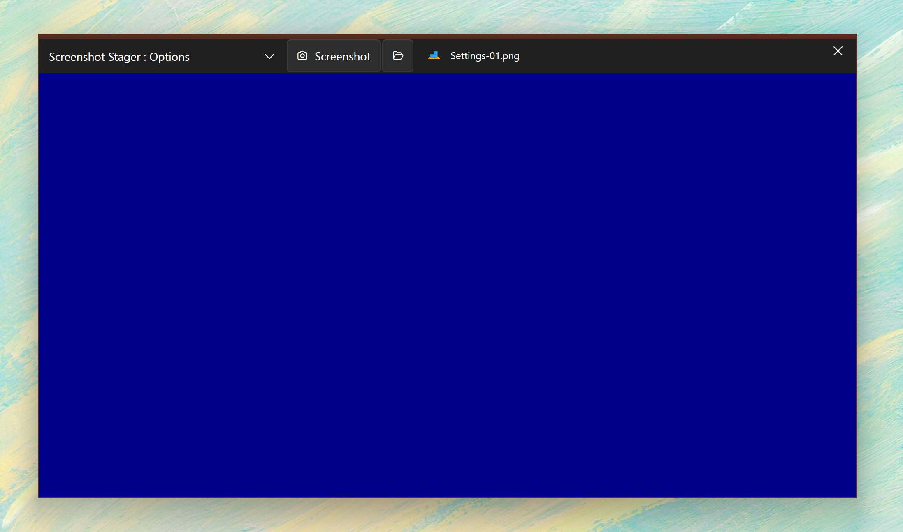

# Screenshot Stager

Take consistent screenshots of you Windows apps for the app submission process.

- Set size of output image
- Pick the background you want to use
- Stage your app window perfectly within the area
- Snap screenshots and automatically index them

## Future plans

- Set the auto save directory
- More options for filename versioning
- Use abstract backgrounds from the web
- Use a hotkey to take the screenshots

## Get in touch

I'd love to hear from you if you find this app useful! Contact me at [JoeFinApps.com](http://www.JoeFinApps.com)
